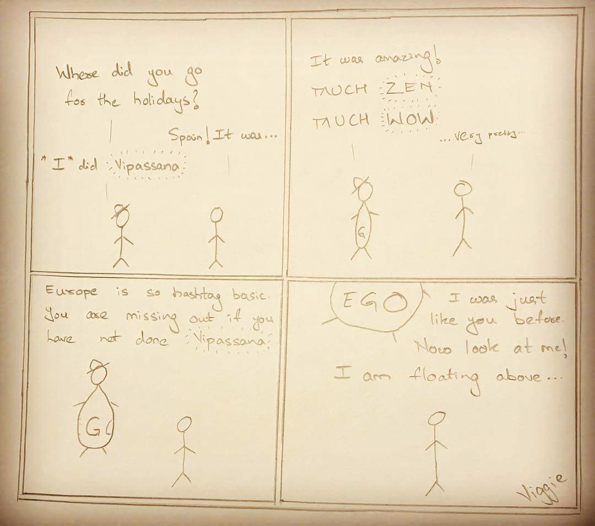

Our senses are our doorway to the world. External information and triggers flow in through them. These triggers generate sensations on the sensory doors.
The egotic mind reacts to sensations with cravings or aversions.

You like something. You develop a craving for it. It goes away. You experience misery because you wanted more of it.
You dislike something. You develop an aversion for it. You experience misery because you want it to go away.

This semi constant state of misery is experienced as stress.

Over the ages, we have devised many modes of ‘battling stress’. Watching movies, exercising, playing games, drinking, smoking up, chatting with close friends, writing, making art, dancing, eating good food, etc.

These modes serve as much needed oases of mental distraction before we lapse back into our usual stressful life.

These modes come with their own costs in the form of time, money and constraints in the form of location, company, occasion, etc. You need to commit 3h for a movie, pay $10 for the ticket and need to physically go to a theatre to watch it. Sometimes as the cravings for a specific mode strengthen, one may reduce constraints and thereby build addiction. Instead of waiting for a happy hour to start drinking, you pop open a bottle of wine every evening with dinner, thereby loosening the constraint to indulge the craving. Instead of going to a theatre for a movie, you get a Netflix subscription and watch one every other evening.

This loosening of constraints is catalyzed by Capitalism. Capitalism fuels itself with Growth. Growth requires Consumerism. Consumerism survives by loosening the constraints of consumption.

These modes come with effects that last for varying periods of time. Almost like a half life. So the mental distraction you source by watching a movie lasts a certain number of days before you need to do it again.

Most modern forms of meditation are another mode of mental distraction eg. distracting your mind by moving focus to the breath or by running through a visualization exercise or by developing a chant as a trigger to distract your mind onto a powerful, unfathomable idea like devotion to God.

The main advantage in this mode of mental distraction is that the cost is low and the constraints are weak. Once you train yourself in meditative breathing exercises, you pay no money and need about 10–15 minutes of time for one ‘hit’. You don’t need to go to any specific place to do this because your breath is always with you.

I’ve been indulging in this mode of mental distraction for the last couple of years. I’ve found it to be very convenient. I start craving it if I happen to skip it for a few days.

However, the root source of misery continues and these modes are just means of chopping off some heads of the Hydra if she grows one too many.

This root source is the reactionary pattern that the Egotic mind has towards sensations. Imagine cutting off this reactionary pattern at its root! You won’t need the periodic indulgence in mental distraction modes to live a ‘stress-free’ life that so many of us desire!

This is the elevator pitch for the Vipassana technique. Gautam the Buddha realized that the flaw in this reactionary pattern is the expectation/concern that positive/negative sensations should/will last forever. So the Vipassana technique discovered by Gautam the Buddha focusses on the notion of ‘impermanence’ (अनिच्च in Pali or अनित्य in Sanskrit).

Everything in this world is impermanent. The scale of the impermanence may vary. A rock may seem more permanent than a fly. But fundamentally, everything is impermanent. So acting with the expectation or concern that something should or will be permanent is just plain foolish.

This idea makes logical sense to me. However, Vipassana emphasizes that understanding this idea intellectually doesn’t suffice. This is because the reactionary pattern in your mind is a System 1 trait (in TFS terminology) (also called the ‘reptile brain’ sometimes) whereas logic is a System 2 trait.

The idea of impermanence needs to be jammed right before the reactionary block inside the mental circuitry. The Vipassana technique is the answer that the Buddha discovered that enables this.

The technique relies on scanning your body from head to toe and noticing sensations. Good sensations in the form of tingles and bad ones in the form of pain because you’re probably not used to sitting cross legged on the floor for too long. In addition to this, you keep a watchful eye on your mind and see how it starts desiring more of the good sensations and less of the pain. So as your scanning, it will tend to linger on the parts of your body which feel good and skip the ones that don’t. This is where the training comes in. You remind your mind that either sensation is impermanent. And force it to move at an even pace through out the body. Same amount of time spent on the good sensations as well as the bad sensations. In some of the 1h long sittings, I observed that doing this sometimes caused the perceptibly ‘physical’ pain in my knees to disappear. Almost as if the nerve endings there were calling for my brain’s attention so I would respond by releasing my cross legged stance but then gave up once they realized that it wasn’t happening. The ‘pain’ came back again of course and I noticed how my mind responded with an aversion to that return and a craving for victory over the pain.

Since coming back from Vipassana, I’ve tried to stick to the recommended 1h per morning and evening sittings to train in this technique with abject failure. Funnily enough, I’ve not meditated much at all since returning because I’d tell myself to do Vipassana and end up doing nothing. I realized that I had found it easier to build a Headspace/MBSR focussed meditation practice because I had gotten addicted to that mental distraction mode. I would crave the tingly body scan and the mental release at the end when Andy Puddicombe instructs you to let go of your mind and allow it to do what it wants to do and your mind just settles down calmly like a puppy that’s been tugging at a leash because you were holding onto it but doesn’t know what to do once you let go of the leash.

Building Vipassana as a habit is going to be much harder because I can’t rely on the craving to build a habit. Weirdly enough, my main motivation to build a Vipassana practice seems Egotic in nature. It’s the desire to attain enlightenment because “holy crap, wouldn’t that be sick?!”. I sometimes wonder if the Ego could be led to its own demise by indulging in this specific Egotic desire. I am afraid that everything I’ve learnt about the Ego tells me that it’s a very smart beast and won’t be fooled so easily. I suspect that at some point, I’ll have to find a stronger motivation to continue Vipassana because Egotic motivations are accompanied by impatience because they focus on the end result in the future instead of the process in the present. Impatience is the most common and strongest foe I face in many endeavors.

The elevator featured in the title of this article is an internal one that operates in FBNY.

Which gives us ample time to digest this article.
