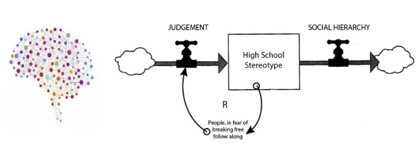

I’ve been fascinated by the duality of these fields for the past few years.

Behavioral Psychology helps one understand how humans think and the biases that affect our decisions. (eg. Why do more favorable court judgments happen after lunch?)

Systems Thinking talks about how we come together to form systems which act in ways that can seem mysterious if only analyzed by focussing on individuals that make up the system.(e.g. How does a violent mob form from pacifists?)

My reading list on this has so far been:

1. [Thinking, Fast and Slow](https://l.facebook.com/l.php?u=https%3A%2F%2Fwww.goodreads.com%2Fbook%2Fshow%2F11468377-thinking-fast-and-slow&h=ATPQXQlpdzIKqjhf-lYtkMGtTQ0yPvP3f93U7vQNn_GYEgMwp3StTTMUkmwhWc-Y28vPBBA74-Q9E_Wd65YxI1jzA8dYtzPV1p9wpD3WHHRe20Ww8RvkgSJqr9QCAPjRnjpA): Bible on behavioral psych written by Nobel prize winning behavioral economist Daniel Kahnemann and Amos Tversky — you’ll understand what biases guide most of your decisions.

1. [Influence](https://l.facebook.com/l.php?u=https%3A%2F%2Fwww.goodreads.com%2Fbook%2Fshow%2F28815.Influence%3Fac%3D1%26from_search%3Dtrue&h=ATO2nmNHY9cAPmuEE49o57Y1zcg0oU3YmUmM9wQg_-_WLhON8y5vLZkPLu3XHNl0GZbQyWb7NcJ7ZQlziOMNjYDuY9Ue5Cxsjeb-yhUEadWgxG-3YI23e6f5yEqyxEw1wHZc): Builds on TFS. Understand how your biases cause you to make poor decisions. Understand how this is exploited by capitalist and consumerist forces. Written by Robert Cialdini (psychologist, campaign adviser to Clinton 2016)

1. [Presuasion](https://l.facebook.com/l.php?u=https%3A%2F%2Fwww.goodreads.com%2Fbook%2Fshow%2F29238799-pre-suasion&h=ATOctoVfL8Xvmjbqm14pX0Gqci94QviLGTU0VaeYvd2aKJ27WZDr_Bq4Vfz3mEsa5phiwPfkeuLLqg9PZ8sbIhKg5ETWKto65m1vPIoJSSSoZv00yIvSLMsdffypjwTMmgG6): Follow up to Influence by Cialdini. Understand how you can be primed to be open to decisions you’d normally not have taken by setting you up for a psychological trap

1. [Never Split the Difference](https://l.facebook.com/l.php?u=https%3A%2F%2Fwww.goodreads.com%2Fbook%2Fshow%2F26156469-never-split-the-difference%3Fac%3D1%26from_search%3Dtrue&h=ATMTzm4ZWwU8MzU5KpLlbyDJc1wM3tbj3Ck8N_Ph10jXw7krURyQMffKy1Nj7m5GkiKKTX9cD7kGSYGT7SCFxb6ErRrRxowvA5ElRUyVLKwRNC461MNpvy3hhh7NtemrFn4u): Explicitly a book about negotiation, but really about empathetic communication, active listening and understanding what motivates people. Thrilling case studies from former FBI Hostage Negotiating Unit head Chris Voss

1. [How to Fail at Almost Everything and Still Win Big: Kind of the Story of My Life](https://l.facebook.com/l.php?u=https%3A%2F%2Fwww.goodreads.com%2Fbook%2Fshow%2F17859574-how-to-fail-at-almost-everything-and-still-win-big%3Fac%3D1%26from_search%3Dtrue&h=ATNcon7vbRCle3cUmwKJ0erqOxKWQvYTaXYH93rOibdv_MGamLW5MREDJtSreQtEeFQU0T6xGCXjILxBQQBRk_6eezj4pA3NTWX0zvjznnkS1gb9LpsZecQXrBQA7VCX2rBs): This funny book covers both individual psychology and systems thinking. Also talks about a probabilistic way of looking at things (something that [Sapiens](https://l.facebook.com/l.php?u=https%3A%2F%2Fwww.goodreads.com%2Fbook%2Fshow%2F23692271-sapiens%3Fac%3D1%26from_search%3Dtrue&h=ATNKAhKSGOXkBu93dVMDWA0g_wEHwGngnkMmx1QVKwT0MZGz-mSZXuaGt31VYej9x9SDkwZaSiDPPknxLcGw6ABhpPI0leC95k5T_SVVzKL_BsjOai_PA13baP7PiHqBoPg-) calls the religion of “dataism”)

1. [Antifragile](https://l.facebook.com/l.php?u=https%3A%2F%2Fwww.goodreads.com%2Fbook%2Fshow%2F13530973-antifragile%3Ffrom_search%3Dtrue&h=ATNJJmo44n5XoC6UH3wm3sbUpifuN_AJ2R1fmw5-ryyRQm5ofY3lloecJcfA0LhQkrcMDFpZE_gIvanKcwfNAjBTE5lP9WsHQnj2y7c5N5aRgGcCdrKUARWigi5poCERpREA): Taleb’s sequel to The Black Swan and Fooled by Randomness. Describes 3 types of systems — fragile, robust and antifragile. Time means chaos. Fragile systems break with time/chaos. Robust systems stay the same. Antifragile systems thrive.

1. [The Dictator’s Handbook](https://l.facebook.com/l.php?u=https%3A%2F%2Fwww.goodreads.com%2Fbook%2Fshow%2F11612989-the-dictator-s-handbook%3Fac%3D1%26from_search%3Dtrue&h=ATMjs4znsyuXPVyl_P25qnlu9FCxCMe8MjLchP0K0-luZUxS9FvpcvA5niZgoTE9d4nE8qkPZKildvpBeJ-DSdY5hG3OodQyceh6I_dDUOMbHe0iJrdyPPzUhp0ekG5KL_uo): Takes a systemic look at governing bodies (autocracies and democracies). What incentives drive political decisions? How do you look beyond the narrative that you read in news media? Looks at cases from modern history. History buffs will love it.

1. [Unethical Decision Making in Organizations](https://l.facebook.com/l.php?u=https%3A%2F%2Fwww.coursera.org%2Flearn%2Funethical-decision-making&h=ATMmsR08pZPIF44Wci_7ftROjnl65w_CXevy4KhSmBh33BpLH309610-GtwwkHd5GSTs_6LWiY_lud2rT2_zkebkev2pfyJ4ZUOJ2I7dIaTPoDZFf5PuMgcPC0h49E1Bq9cU): Uses industry case studies (eg. [Ford Pinto disaster](https://l.facebook.com/l.php?u=https%3A%2F%2Fen.wikipedia.org%2Fwiki%2FFord_Pinto%23Fuel_system_fires.2C_recalls.2C_and_litigation&h=ATPYEWf8fWdY3WS1fOSlrFF_5aitltWrSGSIMdmZBRC89h5ovnZQq_bWmG1i4r4viT-k_6nlQgtBB6x7YkdPh7z4oaFrizKSeL6rF_1hDMFc9yK1os2yGzpQuOP2z-GbjYGw)) to emphasize how systems comprised of ethical actors can still end up being extremely unethical. Blame after such disasters is usually attributed to the actors. Individuals are punished and jailed. Disasters repeat because systemic causes are left untouched.

1. [Thinking in Systems](https://l.facebook.com/l.php?u=https%3A%2F%2Fwww.goodreads.com%2Fbook%2Fshow%2F3828902-thinking-in-systems%3Fac%3D1%26from_search%3Dtrue&h=ATPQH3OOP2Ps2wPd2eGeCkI5xVNFIN2jDmDH837mY3am-0PFsd8hcbob7f-uM2l6RiG4eZkWz7E13fYj7ml-NsUBPAgeeY37aUtDQak7AHiw6Go0eiFtErLMHK3F-sFqq3YG): A theoretical breakdown of how systems work. Very analytical in nature. Introduces a bunch of terminology — stocks, in-flows, out-flows, feedback loops. I studied bits and pieces of this Math in classes on Signal Processing and Network Theory and found it fascinating when applied to real world systems.

1. [Seeing Like a State: How Certain Schemes to Improve the Human Condition Have Failed](https://l.facebook.com/l.php?u=https%3A%2F%2Fwww.goodreads.com%2Fbook%2Fshow%2F20186.Seeing_Like_a_State&h=ATMmiUrK1h89ie465DkAry-FBhPj5Bibt-O8Qh-Z4J_jZKfHErFmZJf5XTwbtXGOoqY_5A1JdrGu1PILbl79jGhFd18OXn-0oZWdtYQIwfNAXT1Tx8roQMl9mLUZejlZfvPd): Historical examples of when the governing state has ignored the nuances of the systems it presides over to implement policies with the right intentions, yet disastrous results (eg. gulags, collectivized farming)
