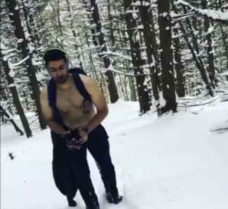

As the weather gets colder, I’m beginning to get back to cold exposure training. It’s my favorite part about New York winters.

My progression in this domain has been as follows -

(2016–17) walking in t-shirts, no jackets

(2017–18) [walking shirtless in NYC and hiking shirtless in Catskills](https://www.instagram.com/stories/highlights/17878850164201272/)

I’m trying to figure out how to level this up in the upcoming winter. I started biking shirtless last week. I might end up making a trip to the Midwest (ahem Justine, Omkar) or to Toronto (ahem Tush, Ashwin) to try out shirtless walks in colder climates.

I get a wide variety of reactions on shirtless walks. Disapproving head shaking. Smiles. Dumbfounded stares. Chuckles that seem to say “oh this is exactly what I’d expect in NYC.” Angry motherly scoldings of the kind “put your jacket on or you’ll fall ill!”.

I usually don’t respond to any of the reactions. Primarily because it takes me away from my focus on my breath, which is the main thing I’m really doing on cold walks. If I lose the focus on my breath, I start shivering and panicking about feeling cold. As long as I’m with my breath, everything is calm and I can go on till mental fatigue kicks in. Typically around the 3h mark during my Catskills hikes in 20F. It’s either mental fatigue or boredom that breaks this state of presentness and makes me susceptible to shivering.

These walks are also an experiment in non-normative behavior. They violate social norms of what people expect to see around them in the winter. The other example of my non-normative behavior that I can remember right now is the [subway tricks](https://www.instagram.com/p/BmFzpumhWFs/?taken-by=viggiereggae) that I really got into while commuting from Ditmas Park.

Societies evolve to discourage non-normative behavior. A clear, concise example of this evolution is the ‘[five monkeys and a ladder](http://workingoutloud.com/blog/the-five-monkeys-experiment-with-a-new-lesson)’ experiment.

Excellence is non-normative by definition. If you’re amongst the best in any domain, you’re demonstrating non-normative behavior in that domain. If you want to be the best, it’s useful to learn how to subconsciously shirk off the feeling of ‘weirdness’ that seems to arise when you perceive that the society is judging you for non-normative behavior. While you’re working towards excellence in a field, society has a tendency to hold you back via judgment. Not intentionally. It’s just how individual human behavior evolves into systemic societal behavior. Once you’re the best in any field, societal judgment flips 180 degrees into admiration. Society lionizes you. Calls you different. Talented. Again in an attempt to reinforce normative behavior by telling the people currently in the normative zone that there was something inherently different about those who break through the normative zones into the [fat tails](https://medium.com/@viggiereggae/cold-exposure-and-non-normative-behavior-6e8c40f48216) of excellence. So that the rest don’t get ideas and continue their normative behavior.

I like playing around with non-normative behavior and observe the reactions. I like to also observe my own reactions when I notice non-normative behavior.

I suspect instinctive, guttural negative judgment of non-normative behavior arises via two mechanisms.

1. I imagine myself in the shoes of the non-normative actor. I then imagine the feeling of judgment I’d perceive from society. That feeling doesn’t feel good. That translates to ‘judgment’.

2. If I am with someone engaging in non-normative behavior, I am concerned about their behavior influencing societal opinion of me. I’m concerned about my distributed Ego\* being hurt.

Both of these mechanisms are non-beneficial for growth.

1, because it’s a [System 1 fallacy](https://en.wikipedia.org/wiki/Thinking,_Fast_and_Slow#Two_systems).

2, because [Ego death is worth pursuing](https://medium.com/@viggiereggae/an-elevator-pitch-for-vipassana-d7ed5f715a6c).

- Distributed Ego is the piece of your Ego that resides in heads of the people you interact with. It’s your perception of the image you’ve created in their minds. Imagine doing something foolish when you’re alone. Now imagine doing the same thing when there are people around who you know and perhaps want to impress. The second situation is harder to deal with because your distributed Ego is active there. More [here](https://www.youtube.com/watch?v=Al6avEKEpJ0).
