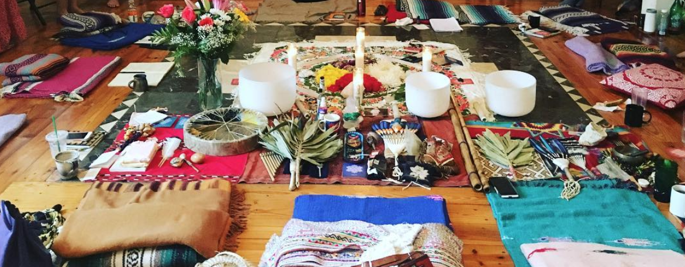

I did a 1 day silence and meditation retreat at Golden Drum yesterday.

It started at 8a in the morning. The first hour was an orientation and basic introduction round for all participants. The silence started with breakfast at 9a.

Silence involved no talking. No eye contact. No gestures.

So naturally, I started doing what any self-respecting chatterbox with lifelong weight issues would do. I started wolfing down food. Jerry, the instructor, had advised us to eat 25% less than what we usually do to aid the meditation practice. I ate twice my regular portions.

The food was plain and simple vegetarian fare but quite delicious. So that aided the hogging. The ‘but’ is because I’ve been a hardcore meat eater. Especially doubling down over the last couple of years as I moved to a ketogenic diet for weight loss and a low FODMAP diet aimed at cut out a lot of veggies for battling IBS. More on that later.

After food, I distracted myself via books. Golden Drum is beautifully designed with a living room area lined with fascinating books and a really comfy couch. It’s actually a house where the instructors live and get trained from their teacher. It felt like home. I browsed through ‘I Am That’ and a couple of books by Stephen Mitchell — ‘Tao Te Ching’ and ‘The Second Book of Tao’.

I find ‘I Am That’ to be a very obscure book that just blows me away the 30% of time that I understand what it’s trying to communicate. I’m gonna grab an original Marathi copy of the book and force myself to read it sometime because a lot can get lost in translation. Given that I was focussed on distracting myself, I couldn’t read it for long.

I really liked ‘Tao Te Ching’ — it’s a bunch of pithy translated verses. I’ve read most of Stephen Mitchell’s Bhagavat Gita before and I find that he does a great job of translating ancient tomes to make them accessible. ‘The Second Book of Tao’ also contains his interpretations for every verse that it includes. Stephen Mitchell seems like he would make a great dinner guest.

The books could hold my attention for only so long. I finally had to confront myself.

The meditation was split up into 3–4 1h sessions. Going in, I was very concerned about being able to sit with folded legs for a long duration. Alyona, another instructor, was super helpful in ensuring that I could sit up comfortably. It’s critical to have an erect spine otherwise it’s easier to fall asleep.

I was quite sleepy in the first one. The food didn’t help. In the second one, my mind started drifting. I was able to practice bringing it back to my breath. The instructors played some musical tones aimed at reminding us of where we were. These served as guides while the mind was busy spinning its own realities. There was an ‘alignment yoga’ session in between conducted by Alyona. I really liked how detailed and specific her instructions were. I got that much closer to an unsupported headstand, but was held back by concerns of landing on my left leg and hurting the ACL.

The third meditation session was most powerful. It started off with some Pranayamic heavy breathing. It tired me out while simultaneously filling me up with oxygen. Oxygen high feels great. A tired mind is a less restless mind. I found it easier to get into a clear state of mind. The Wim Hof Method exercises are also designed around these principles. I plan to incorporate some aspect of Pranayamic heavy breathing into my routine. Headspace tends to be slower.

By this time, the silence was getting really uncomfortable. All sorts of memories and thoughts from the life were floating through. I was trying my best to acknowledge them and move on. But the more I moved on, the more thoughts fluttered through.

The instructors started off on a ‘yin yoga’ session. It involved lying down with some props to stretch and open up specific muscle groups while the instructors collaborated to play some amazing tribal music. There was this particular stretch which I later learnt was known as the ‘heart opener’, which brought all of the underlying emotions that I was running away from brimming to the surface via streams of tears.

We finally broke our collective silence, shared our experience and walked out to a snowy New York evening.
