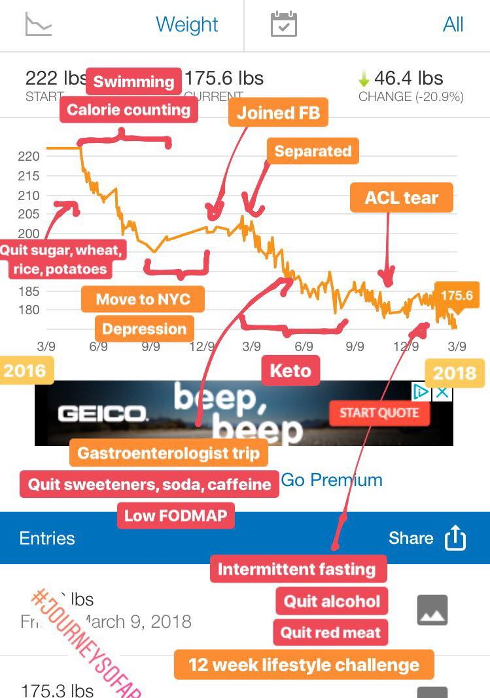
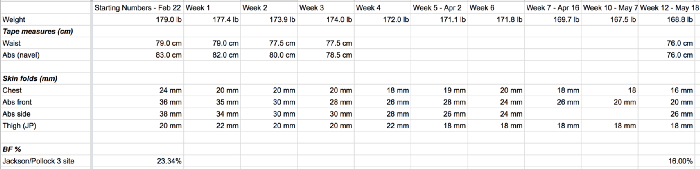
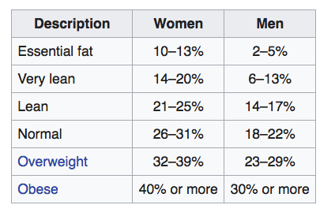

On the occasion of hitting 50lb\* net weight loss, here’s my journey so far.

This is my third (and hopefully final attempt) to move down from 100 kg. 100 kg has always been a trigger weight for me where I wake up from some kind of a deep slumber and start working on reducing my bulk.

The first one was ~25lb drop in first couple of years of undergrad (2005–07) because of healthy but not so tasty mess food. I wasn’t even aware that it happened. Then I discovered Domino’s 3–6 offer and started guzzling 1l of Mountain Dew every day.

The second attempt was in final year of undergrad (2010) after getting the grad school admits. I got scared of coming to the Land of the Free and Obese while weighing 100 kg already. I had visions of being lifted out of my apartment by a crane because I was too heavy for my legs. That attempt was mostly cardio focussed. 1h swimming or running everyday along with eating pulses and reducing rice. Lots of subway sandwiches every day. That’s when I tried calorie counting for the first time. But the diet changes were drastic and relied heavily on my mom’s cooking. So once grad school started, I stopped running and swimming and got tired of Subway sandwiches and piled it back on.

This attempt truly started in 2013 when I started basic conditioning with a gym trainer. I vividly remember failing at an unweighted squat because I had no core strength whatsoever and had a tire around my waist. I gradually got into lifting and worked my way up to body weight squat 5x5s while still remaining at around 220 lb. Each time I’d get to around 250lb, my hip flexors would tap out and I’d inflame them. I’d take a break and get back to empty bar and work my way up. It took me three cycles to realize that I should go to a physio. Back and front muscle chain mobility is now one of my core goals for 2018.

I also got into climbing in 2014 and really enjoyed it but never got past 5.10b because I didn’t have proper technique and was lugging around too much extra weight. Climbing was exhilarating and I pushed myself. To the point that there was an evening where I found myself behind the steering wheel of my car parked in a desolate Sunnyvale parking lot unable to move my arms to even make a phone call. I sat there for a good 30 min before I regained use of my arms. I decided to take a break from climbing and come back to it once I had shed the extra luggage (still haven’t gotten back to it 😛 because I hurt my hip and knee in quick succession after I had shed the luggage).

My third attempt started when I was on a trip to Goa with some of my undergrad mates. I saw some pictures (I never liked taking pictures of myself. No prizes for guessing why 😛) and was horrified. An engaging conversation with Abhishek Tiwari and I was ready to count calories again. That’s when this attempt began at 225 lb.

A recurring pattern I’ve observed and was also pointed out to me by Tom Hirschfeld is that whenever I weigh myself everyday and look at the charts, I lose weight. So I invested in an Aria WiFi scale in Jan 2016. I’ve been on a project of minimizing my belongings for a few months now but I’ll carry that scale with me to my death bed.

The main difference in this attempt was that it was a gradual lifestyle change. Focused on one habit change at a time and once it was an established part of my routine, I reassessed, looked at the next habit I could build and focused on that. Rinse and repeat. Every habit was built when there was sufficient incentive to build it. Incentives were dug up by finding and engaging in diverse experiences. That latter part comes naturally to me because I get bored easily. The rest of it just followed smoothly once these links were established. It’s a very capitalist manner of working with yourself. It fucking works as does capitalism for the most parts ;)

The other thing this chart is missing is meditation and cold therapy.

I started taking cold showers in Nov 2016 on a whim after a fun evening with Waj and stuck to it because it helped me with my depression. And then I discovered an entire community and whole new goals. I’m confident it’s improved my BMR which I suspect played a role in restricting my weight gain to 5lb while I was recovering from my ACL surgery during the holiday season of 2017.

I was the kind of guy who mocked people for meditating. Harshad Maral can attest to it. “Dude, just do it once you are 60. There are more fun things to do right now”. I truly believed that because I observed mostly old people getting into it. Classic correlation-causation fallacy. I signed up on ClassPass in Jan 2016 because as we established, I bore easily so it seemed like the most amazing idea to me at \$79 per month for unlimited. I was in San Francisco then. So obviously, 80% of the options on it were yoga studios. I gave it a shot and fell in love with Ritual Hot Yoga! Strength training, flexibility, sauna and stress reduction in a 50 min duration. What’s not to love! I got addicted to hot yoga as a means of battling stress at a chaotic SF startup. I noticed a couple of patterns then and in the swimming I did the summer after. Whenever my breathing was in sync with my movements, I’d get into these flow states where time just floated by effortlessly. Once I noticed this, I felt incentivized enough to explore meditative breathing exercises. The way it’s helped me with my weight loss is that I’ve built conscious body awareness through it. I can better figure out how I respond to different food items and iterate quicker on my diet.
The rest of my journey is charted in this image because I got bored of typing another 1000 words.

- started tracking on MFP 3lb into it

---

_
 May 2018 
_

I just finished a 12 week lifestyle challenge. This is what I posted as my final update to the challenge group.

## Results

_Feb 22_: 179 lb, 23.34% BF
_May 18_: 168.8 lb, 16% BF

## Diet

This challenge incentivized me to step up the rate of my diet experimentation. I quit alcohol and red meat. Switched to a fish/egg focussed (with some chicken) diet for most of it. Then in the last 3 weeks, spurred by a Vipassana that I attended, I’m doing a vegetarian diet experiment. Most of these changes were induced by tracking my bodily urges with a little bit of push here and there. And trying to disassociate them from my memory urges (fond memories of consuming alcohol, steak, chicken tandoori). In these three weeks, I’ve found myself be super excited by the prospect of eating vegetarian food like nut butter, swiss chard, spinach, oats, apples, cucumbers which is a very new experience for me. So I suspect this is quite sustainable mentally speaking. I’ll have to evaluate how this helps or hinders my health progress. I suspect a plant based diet is what I’m gonna equilibriate on. But right now, I’m super new to this and am probably not “doing it right”. So it’s gonna need a few iterations. I’ll add that the motivations for moving towards the plant-based diets are 40% spiritual. But if I find that it’s really hindering me from getting jacked, I’ll reevaluate. I’m fairly confident and happy that alcohol and red meat are out for good though. Good riddance. Eggs, fish and chicken — I’m not fully sure yet.

## Exercise

I did not stick to any periodic routine as such. Did a bunch of things that my body felt like doing, when it felt like doing. Started off with a 100 pushups, situps, squats challenge. Did a lot of hiking, yoga/hot yoga and dancing, with a tsp of swimming, pole dancing, aerial hoops (tried it out for the first time!) and rock climbing. My main goal for this year is to build a rock solid core so I think my routine going forward is going to be pole (1x per week), hoops (1x), swimming (1x per week), hot yoga (~3x) plus hiking and dance for fun.
I’ll see how that goes. This haphazard routine fits well with my ADD tendencies so it involves very little mental effort. This routine will also hopefully help my open up my hip flexors which are the major blocker in lifting. Once that happens (and hopefully I’ve equilibriated on a plant based diet), I’ll probably do a 2–3 month lifting sprint because I’m a tad bit envious of the muscle definition #gainz some others have had with it the last 12 weeks and because I still hold egotic ambitions of entering the 1000lb club. I also come out of this challenge fairly convinced I need to add some form of HIIT to my routine.
I had a few slump weeks (= ate chocolates, baked goods, pizza, fries) here and there. Induced usually by work stress or just fatigue because I pushed myself too hard or was experimenting too much with my diet.

## Challenge Design

This challenge had a \$30 buy-in. Overall, it was a great way to spend that money. I’d recommend doing it if you get an opportunity. The format is pretty easy.

1. Get people to join in with a monetary buy in. This is important because monetary buy in is a good indicator of intent. You need people with strong intent of improvement.
2. Add gamification by declaring winners who get money. Games are fun especially when leveraged towards your goals.
3. Set up a spreadsheet like the one below. You really only need to track weight (You should get a wifi-connected scale if you don’t have one yet. Like drop what you’re doing now and get one.) and body fat.
4. Daily — Weigh yourself everyday with wifi-connected scale which syncs automatically and shows you pretty graphs.
5. Weekly — Every Monday morning, measure body-fat using Jackson-Pollack 3pt method (details below) and take progress pics — _relaxed_ front, back and side. This Monday morning routine will take 15 min the first time you do it as you are figuring stuff out. And 4 min every Monday after that.
6. Add some “homework” every week which basically serves as a reminder to people that they’re still in the challenge — comment with what food you ate, comment with how many times you cheated, comment with your workout routine. This builds accountability.
   That’s pretty much it.

## Measuring fat

Don’t trust digital measuring devices. They are VERY WRONG.
Buy a caliper. Use Jackson-Pollack 3pt method.
http://www.linear-software.com/online.html
https://www.youtube.com/watch?v=6KLdyRJIAqk
https://www.youtube.com/watch?v=hvC2TDs95xY
Get a DXA scan before, after if you can afford it (optional).
If you’ve read this far, I’d also HIGHLY recommend you get a fat measurement done ASAP. It’ll dispel all myths you hold about how fit you are. Check out the attached wiki table.

Obesity is such an epidemic these days that our baselines are completely screwed up. Once you measure, you’ll know.

---

_
 Jun 2018 
_

I did a DXA body scan during my trip to Menlo Park. I found it super useful and plan to do one every six months.
Attaching [my results](https://www.dropbox.com/s/taum7i0b4gixftx/bodyspec-results-viggie.pdf?dl=0) so you can see what kind of data this scan gets you about your body.

Here’s my main takeaway.
There’s two types of fat in your body.

Visceral fat is fat surrounding vital organs. I have 1lb of it right now. This fat can and should be zero. The more you have it, the likelier you’ll be diseased in old age. This is colloquially referred to as ‘skinny fat’. If you look thin but have a crappy diet (sugar and other simple carbs), it’s likely that you have visceral fat. This fat content is impossible to figure out without a DXA scan — caliper methods (eg. Jackson Pollack), body impedance measurements and water volume displacement won’t get you this value. Get a DXA done!

This fat is diet driven. Cutting out sugar, wheat, rice, potatoes? should suffice to drive this value down.

The other fat is subcutaneous. This is the fat that’s visible and sits under your skin. I have 33.6 lb of it right now (majority of my fat content). That brings my BF % to 20.6% which puts me at 70 %ile of men my age. A goal I have in life is to be at 90 %ile across a variety of domains. Per that, I’ve updated my short term BF target to 15%.

This number is higher than the numbers I’ve gotten from Jackson-Pollack or the weighing scales with body impedance measurements. I’m not surprised at this. Most commonly accessible BF measuring modes seem to underestimate.

The other useful piece of info that came out fo this scan is bone density. AFAIU, bone density is easier to build when you’re young and is typically not lost easily (unlike muscles which atrophy pretty quickly if you don’t use them). Bone density is built with heavy lifting and high impact activities. I have not been weightlifting for a couple of years now. Mostly because I’ve found a bunch of other activities that excite me more. One of my concerns about this lifestyle change was that I might be ignoring bone density gainz. But it turns out that my measurements came out at 98%ile. I bet most of this came from barbell lifts which was my main mode of exercise from 2014–2016. So I don’t need to get back into lifting for this reason. Dancing also seems to help with bone density.

The other surprising but obvious-in-hindsight result was the rest metabolic rate (RMR). I need 1600 cal/day to sustain myself. I had not mentally updated this number from the 2100 cal/day figure I had computed when I calorie counted 2 summers and 57 lb ago.

tldr; GET A DXA SCAN ASAP

Unfortunately, NYC’s gargantuan city laws means that a DXA scan costs > $300 here and you have to go to a hospital to get it done and may have to jump through a few hoops. It costs $45 with BodySpec in California — so plan it out for your next trip to the inferior coast.
